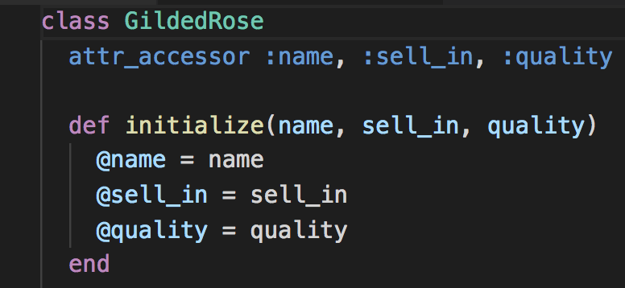
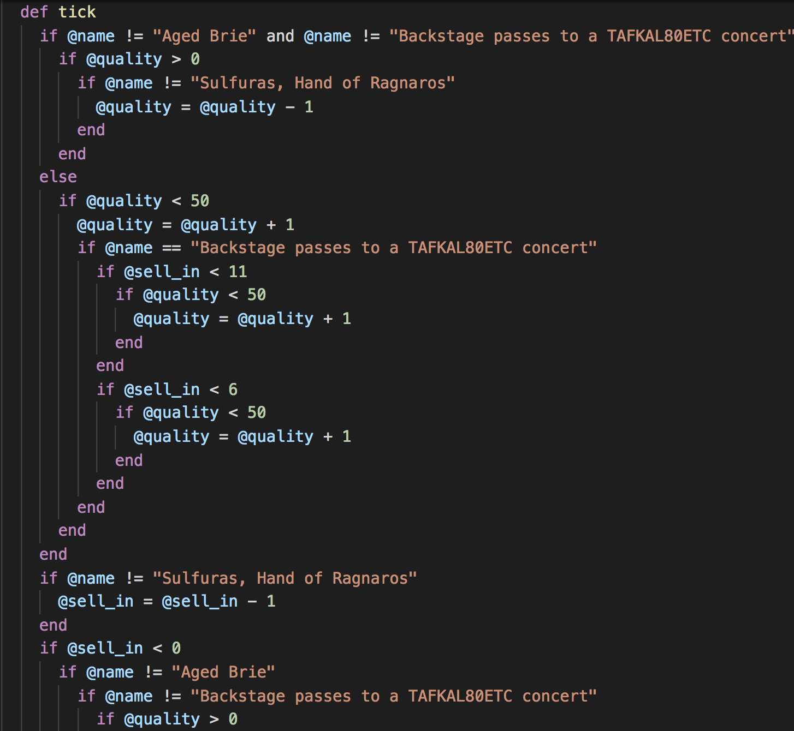
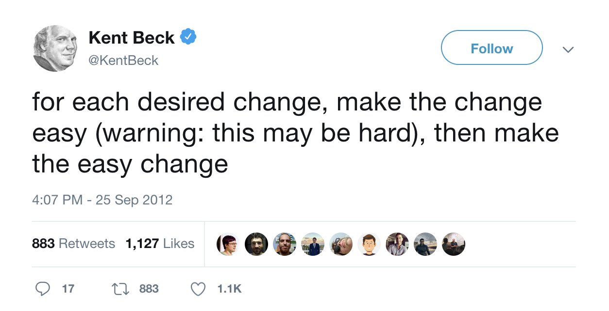

## Testify: A Refactoring Lecture

---

### Disclaimer

--

* Atlanta Bonus lectures are an experiment. They are ideal for exploring topics
  we don't have time to cover in the normal curriculum. If there's a topic you'd
  be interested in seeing covered please come talk to me!

--

* This week's topic is Legacy Code and how to test and refactor it.
  * Today will likely be mostly testing, perhaps with a dash of refactoring at the end.
  * Tomorrow will be heavy refactoring.

--

* This lecture is inspired by talks from Sandi Metz and James Dabbs.

> If you like this lecture, I would strongly encourage you to watch their talks as well!
> Start with [All the Little Things][sandi] and then see James' [Refactoring Live][james].

--

* The talking:livecoding ratio may feel different than usual lectures, the goal of these talks is to make you think differently about code.

--

* Please feel free to stop me and ask questions at any point.

[sandi]: https://www.youtube.com/watch?v=8bZh5LMaSmE
[james]: https://www.youtube.com/watch?v=LhX5COR8WXc

---

### Objectives

--

* Know working definitions of "Refactoring", "Legacy Code", and "Tech Debt"
* See tools like: code coverage, watch commands
* Be able to reason about what code is not currently tested
* Be able to trap an execution path for refactoring

--

### Guiding Questions

* How would you define refactoring?

--

* Okay. What about legacy code?

--

* Who stopped to look at a bug in the last month and didn't remember how the code was even _supposed to work_?

---

### Task

--

* There is a class called GildedRose that people in the office whisper about.

--

* One day, your boss asks you to make some changes to GildedRose.

--

* Huh, seems pretty reasonab...

---

### Task (cont)

---

### Task (cont)

* You look at the code and recoil in horror.

--

* All the engineers that had detailed knowledge of the code have left the company.

--

* There are no tests.

--

* ... Quit Immediately? [y/n]

---

### Questions

* Can we unskip the tests and implement the feature?

--

* Should we?

--

### Beating Bad Code

---

## Sidebar: Bad Code

As programmers we spend a lot of time critiquing code. Bad code isn't just whatever we don't like.

There are excellent books that talk about Object Oriented Design and Refactoring and how to recognize troubling patterns in code and take _systematic steps_ to fix them. Here are two:

---

## Legacy Code

Legacy code is code that engineers no longer understand but still generates a profit.

--

Often it's messy and untested. There may have been _good reasons_ for the design. But there's no one left around to explain them.

--

**If** we try to change this code, we are compelled to disturb as little as possible to avoid breaking things. That means following the existing (bad) patterns and in turn compelling future programmers to do the same.

--

Our better option is to Refactor, making this code as clean and correct as possible before adding functionality.

--

But how do we know that our code does the same thing before _and_ after our refactoring? Tests are the only option. So we'll have to write some.

---

### A reminder on testing

--

There are different kinds of tests but often the most straightforward ones are unit tests.

--

Unit tests should only check one method at a time and only for one set of inputs and outputs.

--

To write them, I follow a pattern I like from Jim Weirich:

--

* Given some starting data, x  `x = Thing.new()`
* When I run a method on it, y  `x.y(whatever)`
* Then I expect to see a change, z  `expect(x.data).to eq(z)`

---

### Code Coverage

--

How confident are you that you could catch everything that needs to be tested?

Probably not super confident.

--

That's why we have code coverage tools!

--

They tell us exactly which lines have been run by our tests. So we _know_ what code isn't tested.

--

I have an editor integration called "Code Coverage Gutters" that lets me display this in the file.

---

## Now Test The Hell Out Of It!

# 😤😤😤

---

### Refactoring Time!

Remember: Refactoring is about cleaning up the code to make
future changes easier _without_ changing it's existing behavior!

--

Now that we have tests, your first instinct with this code may be
to throw it away and start over. But refactoring is a series of many small steps.

--

At any point, we should feel confident stopping the refactoring and
getting back to adding new features or working on a different part of the code.

--

### You Won't Believe this one Refactoring Trick

Refactoring the whole thing at once is a deathwish.

So instead, try to break apart a piece of the code and redirect it
to a _new_ method or class. Those tests should **start failing**.

That means you redirected that section of the code successfully!
Now make those tests pass and repeat until you've broken the whole thing apart.

--

> By turning a big, complicated thing into many small, knowable things we win.

---

### Refactor Road

Committing as we go, lets:

1. Trap and fix Normal
2. Trap and fix Brie
3. Trap and fix Sulfuras
4. Trap and fix Backstage
5. Fix skipped tests /  add bosses new feature. (Make the easy change.)

--

### The Lunch Decision

Now, based on time, we can:

* Maybe convert these methods to separate classes?
* Maybe refactor the GildedRose class to be an ItemFactory?
* Fix skipped tests.

--

## 🎉🎉🎉🎉🎉

---

### Why Test?

#### Software is never finished.

* Real software lives a long time so inevitably the engineers that know why it was written "like that" disappear. (Sometimes it's even you forgetting what old you knew!)

--

* It exists in a social context to meet human needs. But human needs change all the time so software has to change too!

--

> Every program is part of some other program and rarely fits. - Alan Perlis
  
--

#### Tests are about confidence in changing code you _didn't write_ or _don't remember_.

I think most people get the message "tests keep you from breaking stuff later". That's true.

Equally important is the fact that tests mean you can rewrite the code at any time which happens a lot because _the code is never finished so it is always changing_ ... and sooner or later the changes don't fit.

--

The only way I know of to refactor without fear is if you have tests.

---

### Takeaways

* We need tests as a wall at our back so changing code doesn't become _impossible_.
  (Because eventually the changes needed are deep.)
* Legacy Code is code that has been abandoned from an engineering perspective but is still in production.
* By having tests and "redirecting" a segment of the functionality, we can rewrite in pieces without ever leaving the app committed in a broken state.
* The code will get temporarily worse as you refactor since you have to add more code to safely get to a point where the original code can be removed. (Maintaining behavior.)

---

# Thank You <3

### Additional Resources

#### Talks
* [Sandi Metz - All The Little Things][sandi]
* [James Dabbs - Refactoring Live][james]

#### Books
* [Refactoring by Martin Fowler](https://martinfowler.com/books/refactoring.html)
* [99 Bottles of OOP](https://www.sandimetz.com/99bottles)
* [Practical OO Design in Ruby](https://www.sandimetz.com/products-1-1)

#### Etc
* [Institutional Memory and Reverse Smuggling][reverse-smuggling]
* [awesome-katas-1](https://github.com/gamontal/awesome-katas)
* [awesome-katas-2](https://github.com/samjonester/awesome-katas)
* [The parts of a test][rspec-given]

[reverse-smuggling]: https://web.archive.org/web/20120207113424/http://wrttn.in/04af1a
[rspec-given]: https://github.com/jimweirich/rspec-given#given

---

### My Definitions

--

> Tech Debt(n): Code that people always start explaining by saying "Well, it's like this because..."

--

> Refactoring(n): Rewriting code while _maintaining behavior_ to simplify future changes.

--

> Legacy Code(n): Code no one understands and everyone is afraid of changing.

Esp code with:

* No documentation
* Few or no tests
* No remaining engineers that understand the design
